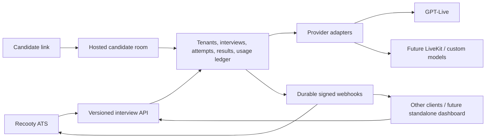

# Recooty AI interview integration: phased implementation plan

Revision: 2026-09-16. Phase 1 contract foundations and Phase 2 PostgreSQL sandbox foundations implemented; live execution integration and ATS UI remain pending.

## 1. Goal and boundaries

Build an independent, multi-tenant interview service, with Recooty as its first integration customer. Recooty owns the recruiting workflow and customer subscriptions. The service owns interview execution, normalized results, and authoritative usage measurement. Replacing GPT-Live, adding LiveKit/custom models, or replacing the entire service must not require changes to Recooty's business logic.

There are two separate contracts:

1. **External interview API:** Recooty or another client creates/configures interviews, obtains candidate links, receives events, and reads results/usage. This contract is provider-neutral.
2. **Internal provider interface:** adapters implement planning, live execution, transcript collection, assessment, usage reconciliation, and termination. Provider SDKs and transport details stay behind this boundary, including in the candidate UI.



The browser is not the authority for billing, final status, or evidence integrity. A reconnect must not create another chargeable interview by accident.

## 2. Repository findings and integration dependencies

### Interview service

- Next.js app with SQLite persistence, a shared passcode, AI-led and reviewed-plan modes, live sessions, transcripts, and reports.
- `app/api/live/session/route.ts` creates an OpenAI session directly; `lib/types.ts` exposes provider voices/model names; `lib/database.ts` requires an `openai_session_id` on an interview row.
- `app/api/interviews/complete/route.ts` accepts browser-supplied duration. Report generation accepts the browser's transcript and is initiated by the browser. Closing the tab can leave no report.
- Current usage/cost estimates are useful for prototype visibility, not yet a customer billing ledger.
- Preserve the MVP for development; introduce a production path with scoped access, asynchronous workers, and durable session capture.

### Recooty

- Laravel with Cashier and `lucasdotvin/laravel-soulbscription` pinned to `4.3.4` in the inspected manifest, sourced from Recooty's fork.
- `app/Models/Team.php` combines billing and Soulbscription; `app/Classes/Payments/Subscription.php` already consumes AI credits. Interview consumption should have a distinct feature/meter, rather than silently sharing unrelated AI credits.
- `ScheduleInterviewInterviewerType` and `ScheduleInterviewCandidateType` own fixed-time and candidate-slot scheduling. `ScheduleInterviewRequest` currently assumes human interviewers and conventional meeting types.
- Interview models/enums come partly from **`recooty/core`**, including the interview type and scheduler type. Confirm the published package contract before introducing a new enum; never patch `vendor/`.
- `AutoInterviewScheduleNotification::getBookingLink()` points candidates to **`CAREER_PAGE_DOMAIN`**. The slot-booking completion implementation must be traced in that application before declaring candidate-selected scheduling complete. It may need a third repository change.
- Existing outbound ATS webhooks are separate from the new inbound interview-service receiver.
- Current ATS duration choices differ from the interviewer UI. Populate AI-interview choices from service capabilities and product policy rather than reusing human-interview durations blindly.

### Branches created

| App / existing checkout | Branch | Starting point |
| --- | --- | --- |
| `/Users/yashgupta/WORK/gpt-live-ai-interviewer` | `codex/ai-interview-integration` | local `main`, `bec39d6` |
| `/Users/yashgupta/Laravel/recooty` | `codex/ai-interview-integration` | fetched `origin/development`, `a70757a8f` |

Recooty already was a Git worktree; use it at the requested path. Its previous `refactor/bulk-queue-routing` branch remains available. The interviewer's pre-existing untracked `tsconfig.tsbuildinfo` is unrelated. No commits or pushes are part of this planning task.

## 3. Ownership and tenant model

| Concern | Authority |
| --- | --- |
| Jobs, applications, recruiting stages, recruiters, slot selection, invitation emails | Recooty; another client supplies its own equivalents |
| Interview configuration snapshot, candidate access, execution, attempts, normalized transcript/result | Interview service |
| Measured usage, service credit grants, reservations, service settlements, provider costs | Interview service |
| Recooty customer plans, retail prices, included allowance, add-ons, invoices | Recooty / existing subscription stack |
| Standalone customer plans and invoices | Future service billing integration |

Use **client account → workspace → interview → attempt**:

- Recooty is one client account with a service wallet. Each Recooty team maps to a separate workspace, with an opaque `external_id` and optional workspace quota. A standalone customer uses the same model with one or more workspaces.
- API credentials are hashed at rest, scoped, rotatable, and separate for test/live environments. Account credentials may act only on their workspaces; workspace credentials cannot escape that workspace.
- Every query, background job, artifact, result, and event carries account/workspace identity. Resolve ownership from authentication and stored mappings, never trust candidate-provided tenant IDs.
- Keep candidate/job/application references opaque. Do not require Recooty database IDs, enums, model classes, or candidate email as a global key.
- Store only needed candidate/job context as a snapshot. Employer-only notes and assessment instructions must not be exposed in candidate responses.

Recommended service foundation: PostgreSQL for transactional state/ledger, durable background jobs, private object storage for artifacts, and an outbox for event delivery. Keep Next.js initially; do not rewrite the app in Laravel just to reuse a PHP subscription package. Choose the queue/deployment implementation during Phase 1.

## 4. Provider-neutral external contract

Publish a versioned OpenAPI contract, JSON Schemas, example fixtures, a changelog, and consumer/provider contract tests. The service repository owns the initial canonical contract; pin a released contract version in Recooty. Planning documents in the two repositories are synchronized snapshots, not two competing API definitions.

### Proposed API surface

| Endpoint | Purpose |
| --- | --- |
| `GET /v1/capabilities` | Supported modalities, modes, languages, duration limits, planning and artifact capabilities |
| `POST /v1/workspaces` | Provision a client workspace using an idempotent external reference |
| `POST /v1/plans` / `GET /v1/plans/{id}` / `PATCH /v1/plans/{id}` | Generate, review, and revise a question plan asynchronously |
| `POST /v1/interviews` | Create an interview from an immutable config or reviewed plan version |
| `GET /v1/interviews/{id}` | Read execution, assessment, usage, and synchronization state |
| `GET /v1/interviews?updated_after=...&cursor=...` | Cursor-based reconciliation; overlap time windows and deduplicate IDs/versions |
| `PATCH /v1/interviews/{id}` | Reschedule/update before starting, guarded by expected resource version |
| `POST /v1/interviews/{id}/access-links` | Issue/rotate/revoke candidate invitations; not a provider session token |
| `POST /v1/interviews/{id}/cancel` | Idempotent cancellation with explicit behavior for active attempts |
| `GET /v1/interviews/{id}/result` | Normalized, revisioned assessment result; explicit pending/failed response |
| `GET /v1/interviews/{id}/artifacts` | Authorized short-lived access to transcript/optional recording |
| `GET /v1/usage` / `GET /v1/balance` | Paginated settlement records and available/reserved service credits |
| `POST /v1/webhook-endpoints` | Register a verified destination once; do not accept arbitrary callback URLs per interview |
| `DELETE /v1/interviews/{id}` | Asynchronous data deletion, with a minimal non-PII billing audit retained by policy |

Candidate session start/reconnect endpoints are a separate, narrowly scoped surface. They must never grant access to account APIs.

### Example create request

`Authorization: Bearer <server credential>` and `Idempotency-Key: <unique command id>`.

```json
{
  "workspace_id": "ws_example",
  "external_reference": "ats-interview-842",
  "candidate": { "external_id": "candidate-123", "display_name": "Example Candidate" },
  "job": { "external_id": "job-456", "title": "Backend Engineer", "description": "Job context" },
  "configuration": {
    "mode": "adaptive",
    "modality": "audio",
    "language": "en",
    "duration_limit_seconds": 900,
    "difficulty": "mid",
    "follow_ups_enabled": true,
    "interviewer_profile_id": "profile_default",
    "rubric_version_id": "rubric_backend_v1"
  },
  "availability": {
    "kind": "window",
    "opens_at": "2026-10-01T09:00:00Z",
    "last_start_at": "2026-10-07T17:45:00Z",
    "must_finish_at": "2026-10-07T18:00:00Z",
    "display_timezone": "Asia/Kolkata"
  },
  "authorization_budget": {
    "external_reservation_id": "hold_example",
    "metric": "interview_seconds",
    "max_quantity": 900,
    "start_before": "2026-10-07T17:45:00Z"
  },
  "metadata": { "application_reference": "application-789" }
}
```

- Public modes describe behavior (`adaptive`, `structured`), mapping the current `ai-led`/`planned` modes internally. Structured interviews reference an approved immutable plan version; candidate clients cannot revise it.
- Interviewer profiles represent a stable product voice/style; they do not expose OpenAI voice names. Provider, model, SDP, LiveKit room IDs, tokens, and raw vendor events are absent from the ATS contract.
- UTC instants are authoritative; the IANA timezone is for display. Fixed appointments use an explicit joining window. The service validates the remaining allowed duration and rejects impossible windows.
- Candidate-selected slots remain an ATS scheduling concern. Create/update the executable service interview only once the chosen slot is confirmed. A pending ATS booking is not an active provider session.
- Any provider-neutral extension must be optional and capability-discoverable. Reject unsupported requested features; never silently switch modalities, durations, or languages.
- Return opaque interview ID, resource version, normalized states, and allowed next actions. Link issuance is explicit; opening a link must not automatically consume it or start a paid session because email scanners open links.
- Idempotency is scoped by account, endpoint, and key. Same key + different payload returns a conflict. Unique external references provide durable duplicate prevention beyond the idempotency-cache retention period.
- Use integer seconds, explicit score scales, decimal strings or integer credit subunits, ISO timestamps, cursor pagination, and stable machine-readable error codes. Document retryability, rate limits, `Retry-After`, payload limits, and version/deprecation rules.

### Result and event contract

Execution, assessment, and metering have separate states:

- Execution: `created → ready → in_progress → completed | interrupted | failed | cancelled | expired`. Reconnection stays within the same attempt; an authorized retake creates a new attempt with its own budget. Link expiry applies to not-started interviews, not an active interview's assessment work.
- Assessment: `not_requested | pending | processing | ready | insufficient_evidence | failed`.
- Usage: `pending | provisional | settled`, with append-only adjustments after settlement.

The result includes schema version, result revision, interview/attempt IDs, rubric ID/version, normalized transcript turns with stable IDs and timing, summary, assessed competencies, explicit scoring scale, nullable scores, evidence references, coverage limits, and artifact references. `insufficient_evidence` is not a zero score. AI output remains distinguishable from human recruiter feedback; no automatic reject/advance decisions in the initial integration.

Events include `interview.started`, `interview.completed`, `interview.interrupted`, `interview.failed`, `interview.cancelled`, `interview.expired`, `result.ready`, `result.failed`, `usage.settled`, `usage.adjusted`, and `interview.deleted`.

```json
{
  "id": "evt_example",
  "type": "usage.settled",
  "schema_version": "1.0",
  "occurred_at": "2026-10-01T09:15:00Z",
  "account_id": "acct_recooty",
  "workspace_id": "ws_example",
  "subject": "interview/int_example",
  "resource_version": 8,
  "data": {
    "interview_id": "int_example",
    "attempt_id": "att_example",
    "external_reference": "ats-interview-842",
    "external_reservation_id": "hold_example",
    "settlement_id": "set_example",
    "metric": "interview_seconds",
    "measured_quantity": 742,
    "billable_quantity": 742,
    "credit_quantity": "12.366667",
    "rate_card_version": "service-standard-v1"
  }
}
```

The example assumes one service credit per minute, rounded once at settlement to six decimal places; this is a proposed accounting convention, not a decided retail price. Recooty computes its own customer charge from billable quantity and its locked retail rate, never by blindly copying the service credit amount. Event payloads carry minimal PII; `result.ready` points to the authenticated result API rather than embedding the transcript.

### Reliable delivery and recovery

- Persist business changes and outbox events atomically. Deliver webhooks at least once, with bounded exponential retries, jitter, dead-letter visibility, and authorized replay using the same event ID.
- Sign raw body bytes plus timestamp and event ID with a per-endpoint HMAC secret. Support key rotation; verify signatures in constant time and enforce a replay window. Each retry receives a fresh delivery timestamp/signature while the event ID remains stable.
- Recooty verifies and durably records the inbox event before returning success; workers process it asynchronously. Unique event/settlement IDs prevent duplicate result writes or consumption. Out-of-order versions cannot regress state.
- Webhook endpoints require HTTPS and SSRF protections, including DNS/private-address checks and redirect restrictions. Do not put credentials or transcripts in logs.
- Reconciliation polls changed interviews and paginated settlements with durable cursors. An outage, dropped callback, failed assessment, or closed candidate tab cannot erase usage or permanently strand a result.
- Replacing the whole service requires contract conformance, base URL/credential configuration, and migration or draining of existing interviews, links, results, balances, and pending events. It is not just a DNS change. Pin in-flight attempts to their original execution adapter and preserve old links until drained.

## 5. Metering, credits, and charging

### Three separate records

1. **Measured usage:** authoritative session intervals and counts, tied to account/workspace/interview/attempt. For launch, use active interview seconds as the customer-facing meter.
2. **Service credits:** grants, expiry, reservations, debits, releases, and adjustments in the interview platform's immutable ledger. Recooty and future clients use this same mechanism.
3. **Internal cost:** provider audio/time/tokens, planning, assessment, storage, and network costs with model/rate versions. These determine margin, not the external API shape or automatic retail charge.

Use integer microcredits and explicit rounding once per settlement. Snapshot pricing and allowance policy when authorizing work. Never rewrite settled history on a price change. Corrections are separate signed adjustments referencing the original settlement.

### Proposed launch policy

- Sell included interview minutes plus optional top-ups in Recooty; record seconds internally. Initial adaptive/structured tiers can share a rate if margin supports it. Final prices require measured costs from the pilot.
- Initial standard minutes include ordinary planning and one report; rate-limit plan regeneration and track its real cost. Report retries and webhook redeliveries do not charge the customer again.
- No charge for generating/opening a link, waiting on the preflight screen, unused reservations, or no-shows. Charge successful connected interview time; exclude verified connection gaps. Define refunds for service-caused failed attempts before paid launch.
- Candidate-requested early completion bills actual usable duration. Candidate abandonment may bill already-delivered usable time; incomplete or unverified usage remains provisional until reconciled. Do not invent missing usage from the configured maximum.
- Start Recooty with a high explicit service credit ceiling and spend/concurrency alerts. If unlimited access is needed, model it as an explicit policy, not an arbitrarily huge balance; retain metering, operational caps, and cost monitoring.
- The candidate sees duration and access information; employer credit details stay in employer/admin screens.

### Reservation and settlement flow

1. Recooty checks team entitlement and atomically reserves maximum retail units before issuing an executable invitation. Save a stable reservation ID and locked pricing/allowance period. This guarantees prepaid budget but holds units for outstanding invitations; show reserved vs available amounts and keep invitation expiry bounded.
2. Send a bounded `authorization_budget` with the interview. It is a generic client allocation, not a Soulbscription implementation detail. A client does not get to grant itself service credits.
3. At start, the service atomically validates that allocation, the interview window, workspace limits, and the client service balance; reserve the maximum service charge before allocating the provider session. Use an idempotent start command and recover orphaned provider allocations after failures.
4. A trusted service/provider observer records active intervals, enforces duration/concurrency, and stops execution at the authorized limit. Browser duration and heartbeats alone cannot establish billable usage.
5. Settle measured/billable usage once, debit the service wallet, release unused service reservation, and publish a durable settlement. Assessment and its retries can finish afterward.
6. Recooty records the settlement ID and consumes/releases the customer allocation exactly once, transactionally with its inbox/consumption mapping. Apply later adjustments as explicit corrections, never duplicate consumption.
7. Do not release a retail hold merely because a webhook is late. Release after confirmed terminal state or confirmed expiry/revocation that prevents a new start; reconcile active/uncertain attempts. Define a bounded disconnected-session watchdog and manual exception queue.

Soulbscription provides consumption and feature tickets, but an audited distributed reservation lifecycle still needs an application-level adapter. Inspect the installed fork's allocation/refund behavior and period rollover before implementing holds. Ensure all interview allowance checks subtract outstanding holds; consuming one feature must not unintentionally change unrelated AI allowances.

For a standalone customer, the service's subscription/checkout adapter funds the same wallet and uses the same execution/settlement flow; no Recooty call is required.

### Package decision

Keep Soulbscription in Recooty. For the Node service, begin with a small transactional ledger module behind a metering interface; avoid bringing in a separate billing deployment before the business rules are proven. Evaluate OpenMeter when event volume, entitlements, or billing integration warrants it. Even with a metering product, define and test our own reservation, durable deduplication, tenant isolation, and recovery guarantees.

Sources checked during planning:

- [Soulbscription upstream documentation](https://github.com/lucasdotvin/laravel-soulbscription): consumption, feature balances, and tickets. Recooty uses a fork; its source is authoritative for local behavior.
- [OpenMeter usage events](https://openmeter.io/docs/metering/events/usage-events): event-based metering with source/ID deduplication.
- [OpenMeter open-source architecture](https://openmeter.io/docs/open-source/architecture): deployment components and deduplication configuration must be evaluated before relying on defaults.

## 6. Candidate experience and data safeguards

- Recooty offers an **AI interview** execution type, independent of scheduling policy. Employers choose mode, duration, language, difficulty, rubric, optional reviewed plan, availability, and copy-link/send-email action.
- Recommended first pilot flow: complete-anytime-within-a-window invitation, followed by fixed appointments and candidate-selected slots. All three use the same interview API.
- Recooty sends its own invitations/reminders using existing email infrastructure. The interview service returns links; future clients can send their own. A standalone email sender/dashboard can come later.
- Use high-entropy, revocable invitation tokens, stored hashed; exchange through explicit candidate action for a scoped secure session. Do not consume on GET. Prevent concurrent attempts, define recovery/identity verification, and keep tokens out of referrers/analytics. A link proves possession, not a verified legal identity.
- Preflight covers AI disclosure, consent/version, microphone/device checks, supported browser, accessibility alternatives, and clear reconnect/expiry/help states. Server-stored settings cannot be changed by the candidate.
- Begin with audio interaction and persisted transcripts; audio/video recording is off unless deliberately enabled with retention and consent policy. Avoid emotion/personality inference. Assessment requires job-relevant evidence and human review.
- Persist transcript incrementally through a trusted server/provider channel; a browser buffer may aid recovery but cannot establish authenticity. Confirm GPT-Live server observation/capture/termination capabilities in Phase 1. If unavailable, use a server-mediated transport or keep the integration in an unbilled pilot until a trustworthy path exists.
- Authenticate report/artifact access per workspace, use expiring URLs, encrypt stored data, audit access, and set configurable retention/deletion policy. Cover candidate deletion across ATS, service, objects, and provider retention capabilities without retaining PII in accounting records.

## 7. Phased delivery and acceptance gates

### Phase 0 — decisions and workflow mapping (this planning deliverable)

- Establish ownership, tenancy, provider independence, three scheduling policies, and separate retail/service billing.
- Trace careers-site booking completion and `recooty/core` package ownership; record required additional repositories before implementation.
- Confirm defaults listed below; keep prices and jurisdiction-specific retention decisions open until product review.

**Exit:** reviewed plan and known integration owners/dependencies. The branches and initial plan exist; the open decisions and external-repository trace are not yet complete.

### Phase 1 — contract and provider feasibility

- Publish v1 OpenAPI/JSON Schemas, state transitions, examples, normalized transcript/result/usage types, errors, and version rules.
- Define the ATS client interface and separate planner, execution, assessor, and usage adapter interfaces. LiveKit is orchestration/transport and may compose STT/LLM/TTS adapters.
- Build a deterministic fake provider and demonstrate contract compatibility without OpenAI-specific fields reaching Recooty.
- Prove trusted transcript capture, termination, session recovery, and usage reconciliation with the actual GPT-Live integration. Choose database/queue deployment and measure provider capabilities.

**Exit:** contract tests pass against the fake provider; credible trusted metering/capture design exists. Do not promise production billing if this feasibility gate fails.

### Phase 2 — service foundations and durable execution

- Add accounts/workspaces, scoped credentials, PostgreSQL migrations, invitation/session access, provider execution records, attempts, normalized artifacts, and result jobs.
- Adapt the MVP behind the provider interfaces and candidate transport interface. Separate interview IDs from provider session IDs.
- Add durable outbox, webhook endpoint registry, retries, event history, polling APIs, cancellation, limits, and a basic usage/reservation ledger in shadow mode.
- Migrate legacy SQLite data as explicitly internal/demo data; do not infer customer ownership or charge historical prototype usage.

**Exit:** create → invite → conduct → persisted transcript → background report → signed event works after tab closure and worker restart; cross-tenant access is denied and reconnects are deduplicated.

### Phase 3 — Recooty end-to-end pilot

- Add an interview-service HTTP client with config-based URL/credentials, feature flag, queued commands/outbox, and mapping models such as `AiInterview`, `AiInterviewAttempt`, and `InterviewServiceInbox` linked to the existing interview/application/team.
- Expose AI setup, mode/duration selection, reviewed plans, generate-link and send-invitation actions. Add normalized status/report/usage views to the application timeline.
- Use a bounded availability window first. Implement inbound verification/deduplication, background result fetching, cancel/reissue actions, and reconciliation.
- Coordinate the `recooty/core` type change where required; do not pretend AI interviews are Google Meet/Zoom or require fake human interviewers.
- Run with internal teams and service quotas; display shadow usage without customer charges.

**Exit:** a recruiter creates/sends a link; a candidate completes it; the correct team's application receives the report exactly once, including after a simulated callback outage.

### Phase 4 — enforce allowances and enable paid usage

- Add a dedicated Soulbscription interview feature, allowance/top-up UI, retail reservation/settlement adapter, and consistent service grant/ledger APIs for account administrators.
- Lock price versions; implement reservation expiry, plan-period rollover, partial usage, no-show/cancellation release, refunds/adjustments, concurrent starts, and insufficient-credit states.
- Run shadow accounting against measured provider costs, compare ATS and service totals, and validate reconciliation before enabling charges.

**Exit:** concurrent sessions cannot overspend; duplicate/lost/out-of-order events cannot double-charge; every debit ties to a settlement and every balance reconciles.

### Phase 5 — full scheduling integration and production hardening

- Add fixed-time AI appointments and connect the existing candidate-slot booking confirmation/reschedule/cancellation flow, including careers-site changes if necessary.
- Handle late arrivals, timezones/DST, old-link invalidation, cancellation/start races, reminders/no-shows, employer permissions, and invitation retries without duplicate emails.
- Validate backups/restore, job recovery, load/concurrency limits, private artifacts, retention/deletion, consent/accessibility, alerting, and operational runbooks.
- Feature-flag rollout by team; stop new starts on rollback while allowing active attempts, usage settlement, and result delivery to drain.

**Exit:** both existing scheduling workflows continue to work for human interviews and work end to end for AI interviews, with the metering and recovery gates satisfied.

### Phase 6 — independent clients and second provider

- Onboard another client through the same API with isolated workspace credentials, wallet/quota, webhooks, and branding. Add self-service dashboard/payment integration when needed.
- Implement a second real provider/LiveKit pipeline against the same adapter and contract suite. Routing remains internal and capability-driven.
- Test replacing the full service implementation, including data export/import and draining existing links/events. No Recooty business-logic change should be necessary.

**Exit:** a non-Recooty client completes and receives an interview independently, and a provider swap leaves the ATS contract unchanged. The fake provider demonstrates this boundary earlier; a second production provider is not required for the first release.

## 8. Verification matrix for implementation

| Area | Required cases |
| --- | --- |
| Contract | PHP consumer + service schema fixtures; fake-provider interchangeability; unsupported capabilities; additive compatibility |
| Isolation | Cross-account/workspace IDs, candidate token scopes, private artifacts, scoped admin grant access |
| Commands | Duplicate create/start/cancel, retry after timeout, conflicting idempotency payload, concurrent start vs cancel |
| Scheduling | Expired/early/late links, explicit joining windows, DST, reschedule invalidation, confirmed candidate slot |
| Durability | Browser close, provider drop, API restart, worker crash, partial transcript, assessment retry |
| Events | Invalid signature, replay, secret rotation, duplicates, reversed ordering, destination outage, dead-letter replay, cursor reconciliation |
| Billing | Concurrent reservations, exact settlement, no-show release, partial duration, gap exclusion, unknown usage, refund, expired grants, period rollover, high-ceiling/unlimited policy |
| ATS regression | Existing human interview types, interviewer invitations, calendars, permission checks, scorecards, existing AI credits |
| Lifecycle | Candidate deletion, artifact expiry, backup restore, provider migration, rollout/rollback with active sessions |

Use stubbed providers for routine CI; paid live-provider checks should be bounded and explicit. Planning-only changes do not require application builds or database migrations.

## 9. Proposed defaults and unresolved product choices

Defaults to start implementation planning: audio-first; one candidate attempt with resumable reconnect; one report included; seconds-based metering displayed as minutes; Recooty owns emails and retail billing; interview service owns service credits and execution; internal pilot before charges; high explicit Recooty ceiling with safety caps.

Resolve before the relevant phase:

- Whether the first pilot must use existing fixed/slot scheduling instead of the proposed availability-window flow. If yes, pull that work and its careers-site dependency into Phase 3.
- Whether employers must approve every structured plan; what candidate accessibility alternative/support path is provided.
- Retail credit conversion, plan allowances, top-up expiry, refund rules, and allocation behavior across renewal/cancellation. Do not launch paid usage with these undefined.
- Invitation expiry/held-credit tradeoff, retake policy, identity verification level, and allowed candidate result visibility.
- Required hosting region, transcript/recording retention, recording policy, and applicable employment/privacy review before production use.
- Shared package release process and the repository owning candidate booking completion.

## 10. Phase 1 implementation progress

- Added canonical OpenAPI 3.1 / JSON Schema draft contract (0.1.0), shared fixtures, and content-hash pinning under `contracts/interview-service/v1` in the interviewer repository; the Recooty snapshot lives under `tests/Fixtures/InterviewService/v1`.
- Added provider-neutral execution/planning/assessment interfaces, a deterministic execution fake, an observation reducer, and an OpenAI sideband event normalizer. Cumulative usage is deduplicated; missing terminal events remain provisional; capture gaps remain explicit.
- Added a workspace-bound Recooty HTTP client behind an interface, plus webhook signature verification and contract tests. These are not yet wired into controllers, scheduling, or subscriptions.
- Added a shared webhook signing test vector and producers/consumers that agree on exact body-byte signing. Durable outbox/inbox processing is still Phase 2/3.
- Confirmed service organizations/workspaces and server API credentials as the initial auth model, PostgreSQL as the primary database, and a long-running Node capture worker with durable jobs. Individual dashboard login follows when management UI is introduced.
- SDK/source feasibility supports trusted sideband capture, cumulative usage, and remote stop. Paid live validation, replay-gap recovery, and mapping audio duration to billable time remain mandatory gates before charging. See `PROVIDER_FEASIBILITY.md` alongside the canonical contract.

Next implementation unit: **Phase 2 PostgreSQL migrations, organization/workspace/service-account authorization, durable worker/outbox foundations**, then implement the declared API against the fake provider before attaching live execution. No production endpoints, live provider sessions, customer charges, or invitations were activated by Phase 1.


## 11. Phase 2 implementation progress — sandbox foundations

- Added PostgreSQL migrations for accounts, employer workspaces, scoped hashed credentials, interviews, attempts, invitation/session tokens, encrypted idempotent responses, reservations, measured usage, outbox events, webhook endpoints, durable jobs, and a legacy demo archive.
- Uses the existing **Herd PostgreSQL 18 server**, with a separate `gpt_live_interviewer` database. Local connection works through Herd's Unix socket; no isolated database server was installed. Recooty is provisioned as a test account; private local credentials are ignored by Git.
- Added ten API operations: capabilities, workspace creation, interview creation/read, access links, cancellation, result, usage, balance, and endpoint registration. Every resource is authorized by account/workspace; mutation replay survives reconnects and credential rotation. The declared plans/listing/update/deletion/artifact operations remain pending.
- Added an explicit candidate invitation exchange and scoped Secure/HttpOnly session. GET scanners cannot redeem a link; start retries reuse the original attempt. Candidate admission checks availability, authorization budget, atomic workspace quota, and concurrency. Replacement/cancellation revokes access.
- Added a synthetic provider and sandbox candidate screen, durable transcript checkpoints, background unassessed results, zero-charge usage settlements, signed outbox delivery, retry/dead-letter replay, and expired-invitation cleanup. Worker leases fence out stale commits. This verifies the protocol without starting paid live sessions or assessing a real candidate.
- Archived the existing SQLite prototype record as internal/demo data; it does not create a customer interview or usage. SQLite and the MVP remain available.
- Added real PostgreSQL integration coverage on Herd using disposable schemas on the same server, plus transport/security tests. Covers tenant isolation, concurrent mutations/starts, quota/cancellation behavior, worker restart, stale leases, signature verification, retries, expiry, and legacy import.
- Operational setup and exact implementation limits are documented in the interviewer repository's `INTERVIEW_SERVICE_SETUP.md`. Recooty's client and pinned schemas are unchanged; ATS UI, inbox and subscription wiring remain Phase 3/4.

**Phase 2 is still in progress.** Next: adapt the real live provider/room to this persisted attempt lifecycle, add long-session worker supervision and trusted usage finalization, then finish planning, reconciliation, artifacts and deletion before claiming the complete Phase 2 exit gate. The synthetic flow is not a real candidate interview or production billing validation.
