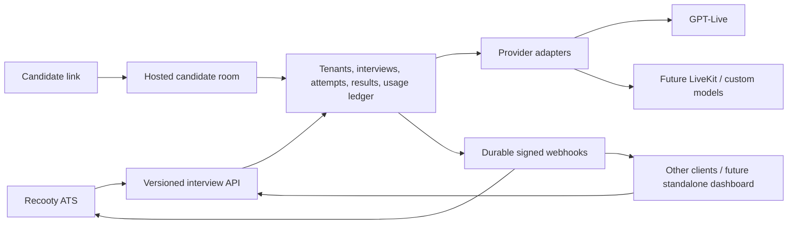

# Recooty AI interview integration: phased implementation plan

Revision: 2026-09-17. Provider-neutral contract, PostgreSQL foundations, Recooty sandbox integration, and gated live-room/worker implementation are in place. Real-provider acceptance and production rollout gates remain open.

## 1. Goal and boundaries

Build an independent, multi-tenant interview service, with Recooty as its first integration customer. Recooty owns the recruiting workflow and customer subscriptions. The service owns interview execution, normalized results, and authoritative usage measurement. Replacing GPT-Live, adding LiveKit/custom models, or replacing the entire service must not require changes to Recooty's business logic.

There are two separate contracts:

1. **External interview API:** Recooty or another client creates/configures interviews, obtains candidate links, receives events, and reads results/usage. This contract is provider-neutral.
2. **Internal provider interface:** adapters implement planning, live execution, transcript collection, assessment, usage reconciliation, and termination. Provider SDKs and transport details stay behind this boundary, including in the candidate UI.



The browser is not the authority for billing, final status, or evidence integrity. A reconnect must not create another chargeable interview by accident.

## 2. Repository findings and integration dependencies

### Interview service

- Next.js app with SQLite persistence, a shared passcode, AI-led and reviewed-plan modes, live sessions, transcripts, and reports.
- `app/api/live/session/route.ts` creates an OpenAI session directly; `lib/types.ts` exposes provider voices/model names; `lib/database.ts` requires an `openai_session_id` on an interview row.
- `app/api/interviews/complete/route.ts` accepts browser-supplied duration. Report generation accepts the browser's transcript and is initiated by the browser. Closing the tab can leave no report.
- Current usage/cost estimates are useful for prototype visibility, not yet a customer billing ledger.
- Preserve the MVP for development; introduce a production path with scoped access, asynchronous workers, and durable session capture.

### Recooty

- Laravel with Cashier and `lucasdotvin/laravel-soulbscription` pinned to `4.3.4` in the inspected manifest, sourced from Recooty's fork.
- `app/Models/Team.php` combines billing and Soulbscription; `app/Classes/Payments/Subscription.php` already consumes AI credits. Interview consumption should have a distinct feature/meter, rather than silently sharing unrelated AI credits.
- `ScheduleInterviewInterviewerType` and `ScheduleInterviewCandidateType` own fixed-time and candidate-slot scheduling. `ScheduleInterviewRequest` currently assumes human interviewers and conventional meeting types.
- Interview models/enums come partly from **`recooty/core`**, including the interview type and scheduler type. Confirm the published package contract before introducing a new enum; never patch `vendor/`.
- `AutoInterviewScheduleNotification::getBookingLink()` points candidates to **`CAREER_PAGE_DOMAIN`**. The slot-booking completion implementation must be traced in that application before declaring candidate-selected scheduling complete. It may need a third repository change.
- Existing outbound ATS webhooks are separate from the new inbound interview-service receiver.
- Current ATS duration choices differ from the interviewer UI. Populate AI-interview choices from service capabilities and product policy rather than reusing human-interview durations blindly.

### Branches created

| App / existing checkout | Branch | Starting point |
| --- | --- | --- |
| `/Users/yashgupta/WORK/gpt-live-ai-interviewer` | `codex/ai-interview-integration` | local `main`, `bec39d6` |
| `/Users/yashgupta/Laravel/recooty` | `codex/ai-interview-integration` | fetched `origin/development`, `a70757a8f` |

Recooty already was a Git worktree; use it at the requested path. Its previous `refactor/bulk-queue-routing` branch remains available. The interviewer's pre-existing untracked `tsconfig.tsbuildinfo` is unrelated. No commits or pushes are part of this planning task.

## 3. Ownership and tenant model

| Concern | Authority |
| --- | --- |
| Jobs, applications, recruiting stages, recruiters, slot selection, invitation emails | Recooty; another client supplies its own equivalents |
| Interview configuration snapshot, candidate access, execution, attempts, normalized transcript/result | Interview service |
| Measured usage, service credit grants, reservations, service settlements, provider costs | Interview service |
| Recooty customer plans, retail prices, included allowance, add-ons, invoices | Recooty / existing subscription stack |
| Standalone customer plans and invoices | Future service billing integration |

Use **client account → workspace → interview → attempt**:

- Recooty is one client account with a service wallet. Each Recooty team maps to a separate workspace, with an opaque `external_id` and optional workspace quota. A standalone customer uses the same model with one or more workspaces.
- API credentials are hashed at rest, scoped, rotatable, and separate for test/live environments. Account credentials may act only on their workspaces; workspace credentials cannot escape that workspace.
- Every query, background job, artifact, result, and event carries account/workspace identity. Resolve ownership from authentication and stored mappings, never trust candidate-provided tenant IDs.
- Keep candidate/job/application references opaque. Do not require Recooty database IDs, enums, model classes, or candidate email as a global key.
- Store only needed candidate/job context as a snapshot. Employer-only notes and assessment instructions must not be exposed in candidate responses.

Recommended service foundation: PostgreSQL for transactional state/ledger, durable background jobs, private object storage for artifacts, and an outbox for event delivery. Keep Next.js initially; do not rewrite the app in Laravel just to reuse a PHP subscription package. Choose the queue/deployment implementation during Phase 1.

## 4. Provider-neutral external contract

Publish a versioned OpenAPI contract, JSON Schemas, example fixtures, a changelog, and consumer/provider contract tests. The service repository owns the initial canonical contract; pin a released contract version in Recooty. Planning documents in the two repositories are synchronized snapshots, not two competing API definitions.

### Proposed API surface

| Endpoint | Purpose |
| --- | --- |
| `GET /v1/capabilities` | Supported modalities, modes, languages, duration limits, planning and artifact capabilities |
| `POST /v1/workspaces` | Provision a client workspace using an idempotent external reference |
| `POST /v1/plans` / `GET /v1/plans/{id}` / `PATCH /v1/plans/{id}` | Generate, review, and revise a question plan asynchronously |
| `POST /v1/interviews` | Create an interview from an immutable config or reviewed plan version |
| `GET /v1/interviews/{id}` | Read execution, assessment, usage, and synchronization state |
| `GET /v1/interviews?updated_after=...&cursor=...` | Cursor-based reconciliation; overlap time windows and deduplicate IDs/versions |
| `PATCH /v1/interviews/{id}` | Reschedule/update before starting, guarded by expected resource version |
| `POST /v1/interviews/{id}/access-links` | Issue/rotate/revoke candidate invitations; not a provider session token |
| `POST /v1/interviews/{id}/cancel` | Idempotent cancellation with explicit behavior for active attempts |
| `GET /v1/interviews/{id}/result` | Normalized, revisioned assessment result; explicit pending/failed response |
| `GET /v1/interviews/{id}/artifacts` | Authorized short-lived access to transcript/optional recording |
| `GET /v1/usage` / `GET /v1/balance` | Paginated settlement records and available/reserved service credits |
| `POST /v1/webhook-endpoints` | Register a verified destination once; do not accept arbitrary callback URLs per interview |
| `DELETE /v1/interviews/{id}` | Asynchronous data deletion, with a minimal non-PII billing audit retained by policy |

Candidate session start/reconnect endpoints are a separate, narrowly scoped surface. They must never grant access to account APIs.

### Example create request

`Authorization: Bearer <server credential>` and `Idempotency-Key: <unique command id>`.

```json
{
  "workspace_id": "ws_example",
  "external_reference": "ats-interview-842",
  "candidate": { "external_id": "candidate-123", "display_name": "Example Candidate" },
  "job": { "external_id": "job-456", "title": "Backend Engineer", "description": "Job context" },
  "configuration": {
    "mode": "adaptive",
    "modality": "audio",
    "language": "en",
    "duration_limit_seconds": 900,
    "difficulty": "mid",
    "follow_ups_enabled": true,
    "interviewer_profile_id": "profile_default",
    "rubric_version_id": "rubric_backend_v1"
  },
  "availability": {
    "kind": "window",
    "opens_at": "2026-10-01T09:00:00Z",
    "last_start_at": "2026-10-07T17:45:00Z",
    "must_finish_at": "2026-10-07T18:00:00Z",
    "display_timezone": "Asia/Kolkata"
  },
  "authorization_budget": {
    "external_reservation_id": "hold_example",
    "metric": "interview_seconds",
    "max_quantity": 900,
    "start_before": "2026-10-07T17:45:00Z"
  },
  "metadata": { "application_reference": "application-789" }
}
```

- Public modes describe behavior (`adaptive`, `structured`), mapping the current `ai-led`/`planned` modes internally. Structured interviews reference an approved immutable plan version; candidate clients cannot revise it.
- Interviewer profiles represent a stable product voice/style; they do not expose OpenAI voice names. Provider, model, SDP, LiveKit room IDs, tokens, and raw vendor events are absent from the ATS contract.
- UTC instants are authoritative; the IANA timezone is for display. Fixed appointments use an explicit joining window. The service validates the remaining allowed duration and rejects impossible windows.
- Candidate-selected slots remain an ATS scheduling concern. Create/update the executable service interview only once the chosen slot is confirmed. A pending ATS booking is not an active provider session.
- Any provider-neutral extension must be optional and capability-discoverable. Reject unsupported requested features; never silently switch modalities, durations, or languages.
- Return opaque interview ID, resource version, normalized states, and allowed next actions. Link issuance is explicit; opening a link must not automatically consume it or start a paid session because email scanners open links.
- Idempotency is scoped by account, endpoint, and key. Same key + different payload returns a conflict. Unique external references provide durable duplicate prevention beyond the idempotency-cache retention period.
- Use integer seconds, explicit score scales, decimal strings or integer credit subunits, ISO timestamps, cursor pagination, and stable machine-readable error codes. Document retryability, rate limits, `Retry-After`, payload limits, and version/deprecation rules.

### Result and event contract

Execution, assessment, and metering have separate states:

- Execution: `created → ready → in_progress → completed | interrupted | failed | cancelled | expired`. Reconnection stays within the same attempt; an authorized retake creates a new attempt with its own budget. Link expiry applies to not-started interviews, not an active interview's assessment work.
- Assessment: `not_requested | pending | processing | ready | insufficient_evidence | failed`.
- Usage: `pending | provisional | settled`, with append-only adjustments after settlement.

The result includes schema version, result revision, interview/attempt IDs, rubric ID/version, normalized transcript turns with stable IDs and timing, summary, assessed competencies, explicit scoring scale, nullable scores, evidence references, coverage limits, and artifact references. `insufficient_evidence` is not a zero score. AI output remains distinguishable from human recruiter feedback; no automatic reject/advance decisions in the initial integration.

Events include `interview.started`, `interview.completed`, `interview.interrupted`, `interview.failed`, `interview.cancelled`, `interview.expired`, `result.ready`, `result.failed`, `usage.settled`, `usage.adjusted`, and `interview.deleted`.

```json
{
  "id": "evt_example",
  "type": "usage.settled",
  "schema_version": "1.0",
  "occurred_at": "2026-10-01T09:15:00Z",
  "account_id": "acct_recooty",
  "workspace_id": "ws_example",
  "subject": "interview/int_example",
  "resource_version": 8,
  "data": {
    "interview_id": "int_example",
    "attempt_id": "att_example",
    "external_reference": "ats-interview-842",
    "external_reservation_id": "hold_example",
    "settlement_id": "set_example",
    "metric": "interview_seconds",
    "measured_quantity": 742,
    "billable_quantity": 742,
    "credit_quantity": "12.366667",
    "rate_card_version": "service-standard-v1"
  }
}
```

The example assumes one service credit per minute, rounded once at settlement to six decimal places; this is a proposed accounting convention, not a decided retail price. Recooty computes its own customer charge from billable quantity and its locked retail rate, never by blindly copying the service credit amount. Event payloads carry minimal PII; `result.ready` points to the authenticated result API rather than embedding the transcript.

### Reliable delivery and recovery

- Persist business changes and outbox events atomically. Deliver webhooks at least once, with bounded exponential retries, jitter, dead-letter visibility, and authorized replay using the same event ID.
- Sign raw body bytes plus timestamp and event ID with a per-endpoint HMAC secret. Support key rotation; verify signatures in constant time and enforce a replay window. Each retry receives a fresh delivery timestamp/signature while the event ID remains stable.
- Recooty verifies and durably records the inbox event before returning success; workers process it asynchronously. Unique event/settlement IDs prevent duplicate result writes or consumption. Out-of-order versions cannot regress state.
- Webhook endpoints require HTTPS and SSRF protections, including DNS/private-address checks and redirect restrictions. Do not put credentials or transcripts in logs.
- Reconciliation polls changed interviews and paginated settlements with durable cursors. An outage, dropped callback, failed assessment, or closed candidate tab cannot erase usage or permanently strand a result.
- Replacing the whole service requires contract conformance, base URL/credential configuration, and migration or draining of existing interviews, links, results, balances, and pending events. It is not just a DNS change. Pin in-flight attempts to their original execution adapter and preserve old links until drained.

## 5. Metering, credits, and charging

### Three separate records

1. **Measured usage:** authoritative session intervals and counts, tied to account/workspace/interview/attempt. For launch, use active interview seconds as the customer-facing meter.
2. **Service credits:** grants, expiry, reservations, debits, releases, and adjustments in the interview platform's immutable ledger. Recooty and future clients use this same mechanism.
3. **Internal cost:** provider audio/time/tokens, planning, assessment, storage, and network costs with model/rate versions. These determine margin, not the external API shape or automatic retail charge.

Use integer microcredits and explicit rounding once per settlement. Snapshot pricing and allowance policy when authorizing work. Never rewrite settled history on a price change. Corrections are separate signed adjustments referencing the original settlement.

### Proposed launch policy

- Sell included interview minutes plus optional top-ups in Recooty; record seconds internally. Initial adaptive/structured tiers can share a rate if margin supports it. Final prices require measured costs from the pilot.
- Initial standard minutes include ordinary planning and one report; rate-limit plan regeneration and track its real cost. Report retries and webhook redeliveries do not charge the customer again.
- No charge for generating/opening a link, waiting on the preflight screen, unused reservations, or no-shows. Charge successful connected interview time; exclude verified connection gaps. Define refunds for service-caused failed attempts before paid launch.
- Candidate-requested early completion bills actual usable duration. Candidate abandonment may bill already-delivered usable time; incomplete or unverified usage remains provisional until reconciled. Do not invent missing usage from the configured maximum.
- Start Recooty with a high explicit service credit ceiling and spend/concurrency alerts. If unlimited access is needed, model it as an explicit policy, not an arbitrarily huge balance; retain metering, operational caps, and cost monitoring.
- The candidate sees duration and access information; employer credit details stay in employer/admin screens.

### Reservation and settlement flow

1. Recooty checks team entitlement and atomically reserves maximum retail units before issuing an executable invitation. Save a stable reservation ID and locked pricing/allowance period. This guarantees prepaid budget but holds units for outstanding invitations; show reserved vs available amounts and keep invitation expiry bounded.
2. Send a bounded `authorization_budget` with the interview. It is a generic client allocation, not a Soulbscription implementation detail. A client does not get to grant itself service credits.
3. At start, the service atomically validates that allocation, the interview window, workspace limits, and the client service balance; reserve the maximum service charge before allocating the provider session. Use an idempotent start command and recover orphaned provider allocations after failures.
4. A trusted service/provider observer records active intervals, enforces duration/concurrency, and stops execution at the authorized limit. Browser duration and heartbeats alone cannot establish billable usage.
5. Settle measured/billable usage once, debit the service wallet, release unused service reservation, and publish a durable settlement. Assessment and its retries can finish afterward.
6. Recooty records the settlement ID and consumes/releases the customer allocation exactly once, transactionally with its inbox/consumption mapping. Apply later adjustments as explicit corrections, never duplicate consumption.
7. Do not release a retail hold merely because a webhook is late. Release after confirmed terminal state or confirmed expiry/revocation that prevents a new start; reconcile active/uncertain attempts. Define a bounded disconnected-session watchdog and manual exception queue.

Soulbscription provides consumption and feature tickets, but an audited distributed reservation lifecycle still needs an application-level adapter. Inspect the installed fork's allocation/refund behavior and period rollover before implementing holds. Ensure all interview allowance checks subtract outstanding holds; consuming one feature must not unintentionally change unrelated AI allowances.

For a standalone customer, the service's subscription/checkout adapter funds the same wallet and uses the same execution/settlement flow; no Recooty call is required.

### Package decision

Keep Soulbscription in Recooty. For the Node service, begin with a small transactional ledger module behind a metering interface; avoid bringing in a separate billing deployment before the business rules are proven. Evaluate OpenMeter when event volume, entitlements, or billing integration warrants it. Even with a metering product, define and test our own reservation, durable deduplication, tenant isolation, and recovery guarantees.

Sources checked during planning:

- [Soulbscription upstream documentation](https://github.com/lucasdotvin/laravel-soulbscription): consumption, feature balances, and tickets. Recooty uses a fork; its source is authoritative for local behavior.
- [OpenMeter usage events](https://openmeter.io/docs/metering/events/usage-events): event-based metering with source/ID deduplication.
- [OpenMeter open-source architecture](https://openmeter.io/docs/open-source/architecture): deployment components and deduplication configuration must be evaluated before relying on defaults.

## 6. Candidate experience and data safeguards

- Recooty offers an **AI interview** execution type, independent of scheduling policy. Employers choose mode, duration, language, difficulty, rubric, optional reviewed plan, availability, and copy-link/send-email action.
- Recommended first pilot flow: complete-anytime-within-a-window invitation, followed by fixed appointments and candidate-selected slots. All three use the same interview API.
- Recooty sends its own invitations/reminders using existing email infrastructure. The interview service returns links; future clients can send their own. A standalone email sender/dashboard can come later.
- Use high-entropy, revocable invitation tokens, stored hashed; exchange through explicit candidate action for a scoped secure session. Do not consume on GET. Prevent concurrent attempts, define recovery/identity verification, and keep tokens out of referrers/analytics. A link proves possession, not a verified legal identity.
- Preflight covers AI disclosure, consent/version, microphone/device checks, supported browser, accessibility alternatives, and clear reconnect/expiry/help states. Server-stored settings cannot be changed by the candidate.
- Begin with audio interaction and persisted transcripts; audio/video recording is off unless deliberately enabled with retention and consent policy. Avoid emotion/personality inference. Assessment requires job-relevant evidence and human review.
- Persist transcript incrementally through a trusted server/provider channel; a browser buffer may aid recovery but cannot establish authenticity. Confirm GPT-Live server observation/capture/termination capabilities in Phase 1. If unavailable, use a server-mediated transport or keep the integration in an unbilled pilot until a trustworthy path exists.
- Authenticate report/artifact access per workspace, use expiring URLs, encrypt stored data, audit access, and set configurable retention/deletion policy. Cover candidate deletion across ATS, service, objects, and provider retention capabilities without retaining PII in accounting records.

## 7. Phased delivery and acceptance gates

### Phase 0 — decisions and workflow mapping (this planning deliverable)

- Establish ownership, tenancy, provider independence, three scheduling policies, and separate retail/service billing.
- Trace careers-site booking completion and `recooty/core` package ownership; record required additional repositories before implementation.
- Confirm defaults listed below; keep prices and jurisdiction-specific retention decisions open until product review.

**Exit:** reviewed plan and known integration owners/dependencies. The branches and initial plan exist; the open decisions and external-repository trace are not yet complete.

### Phase 1 — contract and provider feasibility

- Publish v1 OpenAPI/JSON Schemas, state transitions, examples, normalized transcript/result/usage types, errors, and version rules.
- Define the ATS client interface and separate planner, execution, assessor, and usage adapter interfaces. LiveKit is orchestration/transport and may compose STT/LLM/TTS adapters.
- Build a deterministic fake provider and demonstrate contract compatibility without OpenAI-specific fields reaching Recooty.
- Prove trusted transcript capture, termination, session recovery, and usage reconciliation with the actual GPT-Live integration. Choose database/queue deployment and measure provider capabilities.

**Exit:** contract tests pass against the fake provider; credible trusted metering/capture design exists. Do not promise production billing if this feasibility gate fails.

### Phase 2 — service foundations and durable execution

- Add accounts/workspaces, scoped credentials, PostgreSQL migrations, invitation/session access, provider execution records, attempts, normalized artifacts, and result jobs.
- Adapt the MVP behind the provider interfaces and candidate transport interface. Separate interview IDs from provider session IDs.
- Add durable outbox, webhook endpoint registry, retries, event history, polling APIs, cancellation, limits, and a basic usage/reservation ledger in shadow mode.
- Migrate legacy SQLite data as explicitly internal/demo data; do not infer customer ownership or charge historical prototype usage.

**Exit:** create → invite → conduct → persisted transcript → background report → signed event works after tab closure and worker restart; cross-tenant access is denied and reconnects are deduplicated.

### Phase 3 — Recooty end-to-end pilot

- Add an interview-service HTTP client with config-based URL/credentials, feature flag, queued commands/outbox, and mapping models such as `AiInterview`, `AiInterviewAttempt`, and `InterviewServiceInbox` linked to the existing interview/application/team.
- Expose AI setup, mode/duration selection, reviewed plans, generate-link and send-invitation actions. Add normalized status/report/usage views to the application timeline.
- Use a bounded availability window first. Implement inbound verification/deduplication, background result fetching, cancel/reissue actions, and reconciliation.
- Coordinate the `recooty/core` type change where required; do not pretend AI interviews are Google Meet/Zoom or require fake human interviewers.
- Run with internal teams and service quotas; display shadow usage without customer charges.

**Exit:** a recruiter creates/sends a link; a candidate completes it; the correct team's application receives the report exactly once, including after a simulated callback outage.

### Phase 4 — enforce allowances and enable paid usage

- Add a dedicated Soulbscription interview feature, allowance/top-up UI, retail reservation/settlement adapter, and consistent service grant/ledger APIs for account administrators.
- Lock price versions; implement reservation expiry, plan-period rollover, partial usage, no-show/cancellation release, refunds/adjustments, concurrent starts, and insufficient-credit states.
- Run shadow accounting against measured provider costs, compare ATS and service totals, and validate reconciliation before enabling charges.

**Exit:** concurrent sessions cannot overspend; duplicate/lost/out-of-order events cannot double-charge; every debit ties to a settlement and every balance reconciles.

### Phase 5 — full scheduling integration and production hardening

- Add fixed-time AI appointments and connect the existing candidate-slot booking confirmation/reschedule/cancellation flow, including careers-site changes if necessary.
- Handle late arrivals, timezones/DST, old-link invalidation, cancellation/start races, reminders/no-shows, employer permissions, and invitation retries without duplicate emails.
- Validate backups/restore, job recovery, load/concurrency limits, private artifacts, retention/deletion, consent/accessibility, alerting, and operational runbooks.
- Feature-flag rollout by team; stop new starts on rollback while allowing active attempts, usage settlement, and result delivery to drain.

**Exit:** both existing scheduling workflows continue to work for human interviews and work end to end for AI interviews, with the metering and recovery gates satisfied.

### Phase 6 — independent clients and second provider

- Onboard another client through the same API with isolated workspace credentials, wallet/quota, webhooks, and branding. Add self-service dashboard/payment integration when needed.
- Implement a second real provider/LiveKit pipeline against the same adapter and contract suite. Routing remains internal and capability-driven.
- Test replacing the full service implementation, including data export/import and draining existing links/events. No Recooty business-logic change should be necessary.

**Exit:** a non-Recooty client completes and receives an interview independently, and a provider swap leaves the ATS contract unchanged. The fake provider demonstrates this boundary earlier; a second production provider is not required for the first release.

## 8. Verification matrix for implementation

| Area | Required cases |
| --- | --- |
| Contract | PHP consumer + service schema fixtures; fake-provider interchangeability; unsupported capabilities; additive compatibility |
| Isolation | Cross-account/workspace IDs, candidate token scopes, private artifacts, scoped admin grant access |
| Commands | Duplicate create/start/cancel, retry after timeout, conflicting idempotency payload, concurrent start vs cancel |
| Scheduling | Expired/early/late links, explicit joining windows, DST, reschedule invalidation, confirmed candidate slot |
| Durability | Browser close, provider drop, API restart, worker crash, partial transcript, assessment retry |
| Events | Invalid signature, replay, secret rotation, duplicates, reversed ordering, destination outage, dead-letter replay, cursor reconciliation |
| Billing | Concurrent reservations, exact settlement, no-show release, partial duration, gap exclusion, unknown usage, refund, expired grants, period rollover, high-ceiling/unlimited policy |
| ATS regression | Existing human interview types, interviewer invitations, calendars, permission checks, scorecards, existing AI credits |
| Lifecycle | Candidate deletion, artifact expiry, backup restore, provider migration, rollout/rollback with active sessions |

Use stubbed providers for routine CI; paid live-provider checks should be bounded and explicit. Planning-only changes do not require application builds or database migrations.

## 9. Proposed defaults and unresolved product choices

Defaults to start implementation planning: audio-first; one candidate attempt with resumable reconnect; one report included; seconds-based metering displayed as minutes; Recooty owns emails and retail billing; interview service owns service credits and execution; internal pilot before charges; high explicit Recooty ceiling with safety caps.

Resolve before the relevant phase:

- Whether the first pilot must use existing fixed/slot scheduling instead of the proposed availability-window flow. If yes, pull that work and its careers-site dependency into Phase 3.
- Whether employers must approve every structured plan; what candidate accessibility alternative/support path is provided.
- Retail credit conversion, plan allowances, top-up expiry, refund rules, and allocation behavior across renewal/cancellation. Do not launch paid usage with these undefined.
- Invitation expiry/held-credit tradeoff, retake policy, identity verification level, and allowed candidate result visibility.
- Required hosting region, transcript/recording retention, recording policy, and applicable employment/privacy review before production use.
- Shared package release process and the repository owning candidate booking completion.

## 10. Phase 1 implementation progress

- Added canonical OpenAPI 3.1 / JSON Schema draft contract (0.1.0), shared fixtures, and content-hash pinning under `contracts/interview-service/v1` in the interviewer repository; the Recooty snapshot lives under `tests/Fixtures/InterviewService/v1`.
- Added provider-neutral execution/planning/assessment interfaces, a deterministic execution fake, an observation reducer, and an OpenAI sideband event normalizer. Cumulative usage is deduplicated; missing terminal events remain provisional; capture gaps remain explicit.
- Added a workspace-bound Recooty HTTP client behind an interface, plus webhook signature verification and contract tests. These are not yet wired into controllers, scheduling, or subscriptions.
- Added a shared webhook signing test vector and producers/consumers that agree on exact body-byte signing. Durable outbox/inbox processing is still Phase 2/3.
- Confirmed service organizations/workspaces and server API credentials as the initial auth model, PostgreSQL as the primary database, and a long-running Node capture worker with durable jobs. Individual dashboard login follows when management UI is introduced.
- SDK/source feasibility supports trusted sideband capture, cumulative usage, and remote stop. Paid live validation, replay-gap recovery, and mapping audio duration to billable time remain mandatory gates before charging. See `PROVIDER_FEASIBILITY.md` alongside the canonical contract.

Next implementation unit: **Phase 2 PostgreSQL migrations, organization/workspace/service-account authorization, durable worker/outbox foundations**, then implement the declared API against the fake provider before attaching live execution. No production endpoints, live provider sessions, customer charges, or invitations were activated by Phase 1.


## 11. Phase 2 implementation progress — sandbox foundations

- Added PostgreSQL migrations for accounts, employer workspaces, scoped hashed credentials, interviews, attempts, invitation/session tokens, encrypted idempotent responses, reservations, measured usage, outbox events, webhook endpoints, durable jobs, and a legacy demo archive.
- Uses the existing **Herd PostgreSQL 18 server**, with a separate `gpt_live_interviewer` database. Local connection works through Herd's Unix socket; no isolated database server was installed. Recooty is provisioned as a test account; private local credentials are ignored by Git.
- Added ten API operations: capabilities, workspace creation, interview creation/read, access links, cancellation, result, usage, balance, and endpoint registration. Every resource is authorized by account/workspace; mutation replay survives reconnects and credential rotation. The declared plans/listing/update/deletion/artifact operations remain pending.
- Added an explicit candidate invitation exchange and scoped Secure/HttpOnly session. GET scanners cannot redeem a link; start retries reuse the original attempt. Candidate admission checks availability, authorization budget, atomic workspace quota, and concurrency. Replacement/cancellation revokes access.
- Added a synthetic provider and sandbox candidate screen, durable transcript checkpoints, background unassessed results, zero-charge usage settlements, signed outbox delivery, retry/dead-letter replay, and expired-invitation cleanup. Worker leases fence out stale commits. This verifies the protocol without starting paid live sessions or assessing a real candidate.
- Archived the existing SQLite prototype record as internal/demo data; it does not create a customer interview or usage. SQLite and the MVP remain available.
- Added real PostgreSQL integration coverage on Herd using disposable schemas on the same server, plus transport/security tests. Covers tenant isolation, concurrent mutations/starts, quota/cancellation behavior, worker restart, stale leases, signature verification, retries, expiry, and legacy import.
- Operational setup and exact implementation limits are documented in the interviewer repository's `INTERVIEW_SERVICE_SETUP.md`. Recooty's client and pinned schemas are unchanged; ATS UI, inbox and subscription wiring remain Phase 3/4.

**Phase 2 is still in progress.** Next: adapt the real live provider/room to this persisted attempt lifecycle, add long-session worker supervision and trusted usage finalization, then finish planning, reconciliation, artifacts and deletion before claiming the complete Phase 2 exit gate. The synthetic flow is not a real candidate interview or production billing validation.


## 12. Phase 3 implementation progress — Recooty sandbox integration

- Added an AI interview panel to the application's Interviews tab, gated by a feature flag, explicit team allowlist, application access and existing interview permissions. Managers can configure duration, availability window, language, level and follow-ups, generate/copy/replace links, cancel, request synchronization, and optionally send invitations. Mode is adaptive until reviewed plans are implemented in the service.
- Added dedicated AI interview/workspace mappings, encrypted request/result/link storage, durable commands with leases and idempotency, signed webhook inbox deduplication, normalized reports/transcripts and an append-only shadow usage mirror. Recooty is a service account; each ATS team maps to a service workspace. No candidate account or OAuth login is needed for invitation admission.
- Jobs use Recooty's existing `ai` queue connection and `{ai}` queue. The minute scheduler recovers expired commands, dispatches pending inbox events and polls known interviews after missed callbacks. Expired or uncertain email delivery is marked for human review rather than automatically resent. Signature verification accepts active and previous webhook secrets during rotation.
- Service account/workspace/interview/attempt/reservation identities are checked before storing data. Lower resource versions are ignored, conflicting equal versions rejected, and duplicate usage IDs must carry the same payload. Sandbox nonzero charges are rejected; Soulbscription and existing AI credits are unchanged.
- The AI flow has separate tables and routes; it does not impersonate an existing human interview type or change `recooty/core`. Existing fixed-time and candidate-slot flows remain intact. Paid allowances, reviewed plans and fixed/slot AI scheduling remain in their planned phases.
- Verification: 33 focused PHPUnit tests / 190 assertions pass, including existing fixed-time creation and slot-booking tests. Vite production build passes. The new panel has no TypeScript diagnostics; the repository-wide check remains blocked by 1,112 existing diagnostics (the baseline and current counts match). Browser visual verification was unavailable because the Chrome DevTools profile was already in use.

**Delivered:** Phase 3's sandbox integration slice. The full real-candidate Phase 3 exit gate remains open until Phase 2's live adapter/room, trusted capture and assessment are connected and a deployed end-to-end pilot is verified. Local tests use HTTP/provider stubs and the existing Herd test database; no candidate email, paid provider call, customer charge, deployment, or production migration was performed. Feature flags and invitation delivery remain off by default.

### Recooty operator setup for an internal sandbox pilot

1. Apply `database/migrations/2026_09_16_153242_create_ai_interview_integration_tables.php` with the normal reviewed deployment migration workflow. Keep `INTERVIEW_SERVICE_ENABLED=false` until the tables and queue workers are ready. Reconciliation is a no-op before its tables exist.
2. Set the HTTPS service base URL, account ID and account-level server credential in Recooty's secret environment. Use the interview service's provisioned test account; never put the credential into browser configuration. Use a trusted certificate and keep TLS verification enabled.
3. Grant `BETA_FEATURES` to the internal teams' plan (section 19 replaced the former `INTERVIEW_SERVICE_TEAM_IDS` allowlist), then enable the feature. Keep `INTERVIEW_SERVICE_SANDBOX=true` and `INTERVIEW_SERVICE_ALLOW_INVITATIONS=false` while testing link generation. A team workspace is provisioned lazily using stable request keys. Accounts and existing workspace mappings cannot silently be swapped.
4. Run the existing Horizon AI supervisor and Laravel scheduler. The queue defaults to `AI_QUEUE` / `{ai}`; a custom `INTERVIEW_SERVICE_QUEUE` must also be watched by a worker. Keep worker timeout below the connection's retry interval. `php artisan interviews:reconcile` can trigger recovery manually.
5. Register the Recooty HTTPS `/api/interview-service/webhook` URL with the interview service. Store the returned secret in `INTERVIEW_SERVICE_WEBHOOK_SECRET`, configure the exact destination hostname in the service allowlist and activate the verified endpoint. Recooty can temporarily accept the previous secret using `INTERVIEW_SERVICE_PREVIOUS_WEBHOOK_SECRET`; coordinated producer rotation is still pending service work.
6. Local/private Herd webhook destinations are intentionally blocked by the service's delivery policy. Local integration tests fake the receiver; status/result recovery uses authenticated polling. Use a controlled public HTTPS staging receiver for the actual outbound delivery pilot. Do not bypass TLS or private-address protections.
7. Test with synthetic candidates and generate links first. Enable invitations only for an explicitly approved internal email test. Creation retries preserve request IDs; uncertain mail must be checked before a deliberate resend. Copying a link does not send a message.
8. Disabling the feature blocks new UI actions while existing inbox/status/usage reconciliation continues. New queued creates stop; already-issued service links need explicit cancellation when rolling back. Do not purge mapping/ledger rows. Candidate/team hard deletion is restricted while integration mappings exist; service deletion/retention remains a prerequisite for production use.

Setup for the service process and Herd PostgreSQL remains in the interviewer repository's `INTERVIEW_SERVICE_SETUP.md`.


## 13. Live execution implementation — unbilled internal pilot

- Connected a consent-based candidate audio room to persisted attempts. The room receives transport SDP only; the service owns provider credentials, instructions, capture, usage, stop requests and assessment. Browser transcript/usage/report submissions are not accepted on this path.
- Added private live execution and assessment interfaces, OpenAI SDK adapters, provider command restrictions, encrypted ephemeral SDP, pinned per-interview routing, deterministic transcript turns, evidence validation, background results and the existing signed outbox flow. Recooty's API contract and implementation are unchanged.
- Added migration 002 and applied it to the existing Herd interview database without rewriting migration 001. Existing synthetic interviews remain synthetic. Live mode requires an explicit flag plus service-account allowlist; defaults remain off and customer billing remains zero.
- Added renewable capture leases, duration/stop supervision, bounded concurrent jobs with capacity for delivery, safe recovery after worker loss, provisional unknown usage and held quota reservations. Creation responses with unknown outcome are quarantined rather than creating another provider session. Remote stop failures remain retryable and assessment failures become visible after three attempts.
- Recovery is conservative: interrupted observers are stopped, incomplete evidence receives no scores, and changing/reloading a browser connection cannot silently create a second attempt. Seamless media rejoin and provider event replay are not claimed.
- Added `attempts` operator inspection for active and provisional cases. Deployment/rollback requirements, real-provider acceptance checks and exact limitations are in `INTERVIEW_SERVICE_SETUP.md`.

Verification: 51 unit/contract/transport tests passed, plus 23 PostgreSQL tests on temporary schemas in the existing Herd instance. Lint, TypeScript and production build passed. Candidate consent controls were checked in a separate browser with synthetic session responses; no microphone or paid provider session was used. An additive local service migration was applied; no Recooty application migration, rollout, invitation or customer charge was performed.

**Next acceptance gate:** run a bounded real-provider interview and confirm audio, stop behavior, final usage, report and callback/poll recovery end to end with an internal Recooty team. Then complete the remaining Phase 2 lifecycle/privacy and Phase 4 billing prerequisites. Local mocked-provider verification does not establish production readiness.


## 14. Local pilot activation and browser compatibility — 2026-09-18

- Applied the additive Recooty migration to Herd's local development database and enabled only CloudTech (team 1). The existing Recooty service account is live-allowlisted; credentials stay in ignored local files, invitations stay disabled and customer billing remains zero.
- Verified the actual authenticated HTTPS capabilities/workspace requests and created a two-minute internal pilot through the queued ATS integration. The ATS uses a dedicated local `{ai-interview-pilot}` queue. Local result recovery uses **Sync status**; outbound webhooks require a controlled public HTTPS destination.
- Corrected two browser-only failures missed by the earlier server-side checks: Next's development-origin guard blocked HMR for the Herd hostname, and Recooty's HTTP origin did not expose `crypto.randomUUID()`. The local hostname is now explicitly allowed and the ATS falls back to cryptographically random UUID bytes for request keys. A read-only candidate-link field supports manual copying when the clipboard API is unavailable or denied.
- Verified Continue reaches the consent screen without starting audio, with no candidate-page console errors after a full refresh. After normal user sign-in, the actual HTTP Recooty form created an interview and replaced its link; both queued commands completed successfully. The HTTP clipboard fallback selected the complete link for manual copying; the extra UI-test interview was then cancelled. Two request-key regression tests and the 13 focused Recooty integration tests (90 assertions) passed. Recooty's frontend built successfully; its existing Sentry source-map upload reported an unrelated project configuration error. Service lint and TypeScript checks passed.

- Diagnosed the first real attempt: the provider session existed but emitted no transcript because the integrated adapter omitted the opening prompt used by the MVP. The server sideband now appends English greeting instructions after `session.started`, waits for the matching acknowledgment, and sends one begin command. Duplicate events cannot repeat the greeting; rejected or missing acknowledgments fail capture through the existing stop/recovery path. Browser provider commands remain disabled.
- Verified a bounded real-provider startup using synthetic silence on the internal two-minute invitation, without capturing a physical microphone. WebRTC received nonzero audio energy and the browser audio element was playing. The server captured the AI welcome and role-specific introduction question. Ending the test produced final usage of 69 seconds, zero customer charge, and an insufficient-evidence report because no candidate answered. Recooty's **Sync status** fetched the terminal state and report. The browser closed media before the remote stop completed, so this run was classified as interrupted; graceful candidate-stop ordering was left for the next correction (see section 15).
- Service verification: 54 unit/contract/transport tests passed; the two database suites were skipped by this command (previous Herd lifecycle verification is recorded above). Lint and TypeScript passed. The local worker was restarted with the greeting fix.

**At this point, still open:** a two-way spoken interview and substantive assessment, graceful stop ordering, and the controlled public webhook pilot. Greeting playback, trusted transcript capture, final usage and local polling recovery are verified; they do not complete the full Phase 3 acceptance gate.


## 15. Timed interviews and intentional completion — 2026-09-18

- User pilot transcripts showed premature farewells with time still remaining. The provider prompt now treats quick answers, overlapping speech and pauses as normal conversation. It continues asking relevant questions until a trusted service wrap-up signal instead of estimating duration from question count.
- The private provider interface accepts remaining seconds from the persisted server deadline. OpenAI receives quiet timing context once per 30-second bucket, then one wrap-up instruction in the final 20 seconds and a spoken-closing cue after its acknowledgment. No provider-specific fields or commands were added to Recooty's public protocol. The worker closes at the hard deadline and records `duration_limit`; spoken text alone does not terminate or bill an attempt.
- Candidate End immediately disables microphone input and pauses playback, requests server stop, then waits up to 15 seconds for terminal status before releasing WebRTC. This removes the browser-disconnect race that produced interrupted status on intentional ends. Missing provider finalization and actual capture failures still remain interrupted/provisional. Existing historical attempts are not relabeled or reassessed.
- The candidate screen distinguishes wrap-up and ending, removes the countdown while ending, and replaces stale in-progress text once closed. Restoring the richer MVP interface remains a later UI phase.
- Verification: 55 unit/contract/transport tests and 24 database tests passed on the existing Herd PostgreSQL server; lint and TypeScript passed. The closing-cue transport tests were rerun after live verification identified the missing spoken closing.
- Two bounded real-provider checks used generated speech, no physical microphone. Five quick answers (including overlapping a question) kept the two-minute interview active until automatic completion at about 122 seconds, with settled usage and a ready assessment. A separate one-minute configuration spoke its closing in the final window; the candidate End button completed at about 47 seconds with `candidate_end`, final usage and a ready assessment. The browser released WebRTC and displayed completed status. Customer charges remain zero.

**Remaining acceptance work:** broader natural-speech and network-interruption testing, controlled public webhook delivery, and the previously listed lifecycle/privacy/billing prerequisites. These local regressions do not imply production readiness or guarantee every model utterance follows the pacing prompt.

## 16. Phase 3 report delivery and recovery — 2026-09-18

- Recooty now keeps report retrieval and usage recovery independent: a report outage remains retryable while usage can still import, and a usage outage does not discard a fetched report. Existing resource-version and result-revision guards remain in place.
- Fixed a concrete workspace recovery failure: one stale attempt mapping or service-only settlement previously rolled back the whole usage page. Pages now enter an encrypted durable `ai_interview_usage_inbox` before the workspace cursor advances. Each record imports separately under a lock; unknown ownership/attempts remain `mapping_pending`, invalid identities/charges remain `usage_validation_failed`, and conflicting record replays cannot overwrite stored facts. Later syncs retry pending records. `interviews:reconcile` reports their count for operator review; no ATS application is invented for an unknown owner.
- Recruiter listings expose report/usage availability separately from service status. The panel continues polling after execution ends while report/usage delivery is incomplete, refreshes an open report, explains pending/failed/provisional states, and permits usage inspection even if the assessment failed. Unstarted cancelled/expired interviews do not wait for nonexistent settlements.
- Existing known interview mappings plus idempotent create commands and per-interview polling cover this slice. A cursor-based interview listing is not required for these observed gaps; it remains deferred for broader discovery/reconciliation.
- Reused the completed generated-speech pilot through the normally authenticated recruiter API/UI on its correct CloudTech application. Polling recovered ready assessment revision 1, 13 transcript turns (6 candidate turns), 3 competencies, and exactly one settlement with 117 measured seconds and zero billable seconds. This is measured provider usage, not the roughly 122-second wall-clock duration from section 15. Repeated sync and delayed callbacks do not create another ledger entry.
- Applied only the additive usage inbox migration to local Herd Recooty and gracefully replaced only the dedicated pilot queue worker. Local reconciliation recovered eight mapped settlements; one existing service-only test settlement remains visibly pending because it has no ATS mapping. Do not attach it to an arbitrary application or discard it. No new provider session, candidate email, customer charge, push or deployment was performed.
- Browser verification: the real recruiter panel displayed all 13 transcript turns and the 117-second, zero-charge settlement. Browser-only response simulations proved terminal polling across processing, failed/provisional, ready-but-undelivered and fully delivered states; the open report refreshed automatically. All simulated routes were removed afterward.
- Verification: 34 focused Recooty tests / 234 assertions passed, including missed/delayed/duplicate/reversed signed callbacks, independent outages, pending/failed/provisional states, durable pagination, stale mapping recovery, conflicting replays and sandbox charge rejection. Service: 55 unit/contract/transport tests and 25 database tests passed on existing Herd PostgreSQL, including lost callback acknowledgment followed by worker/pool restart with the same event and settlement identities. Service lint/TypeScript and Recooty Pint/build passed. Recooty TypeScript returned its unchanged 1,112-error baseline with no diagnostics in changed files; the existing Sentry source-map project configuration error remains unrelated.

**Delivered:** the local report-delivery and recovery acceptance slice. **Still open:** public production webhook delivery, deployed outage acceptance, ownership challenge/signing-key rotation and broader lifecycle/privacy/billing gates. The full Phase 3 production exit gate is not complete.

## 17. Environment-scoped webhook delivery — 2026-09-19

- The webhook URL contract permits HTTP or HTTPS because transport policy depends on deployment mode. Recooty's pinned schema must change with the canonical schema.
- Every mode requires an exact hostname in `INTERVIEW_WEBHOOK_HOSTS`, IPv4 resolution pinning, no credentials/fragments/redirects, signed bodies, bounded response time and durable retry/deduplication.
- When `NODE_ENV=production`, activation and delivery require a public IPv4 HTTPS destination on port 443. IP literals and private, loopback, link-local, reserved and multicast answers remain blocked even if allowlisted.
- Outside production, an explicitly allowlisted HTTP/HTTPS `localhost`, `127.0.0.1`, `.test` hostname, private IPv4 address or nonstandard port is allowed. This is for local integration testing only. TLS verification is never disabled for HTTPS.
- Local acceptance used Recooty's real `POST /api/interview-service/webhook` endpoint, a fresh local signing secret, and the service outbox/worker. A signed replay of the existing pilot `result.ready` event completed in one delivery attempt, entered Recooty's durable inbox, and was processed by its dedicated queue after authenticated report/usage recovery from the local HTTPS interviewer API.
- A bounded receiver-outage replay first targeted an unused local port. The same delivery job remained pending with one attempt and the generic `job_failed` operational code. Restoring the endpoint let attempt two complete; Recooty retained exactly one processed inbox row for the event. Polling remains enabled as recovery. No interview, invitation, charge, push or deployment was created.
- Verification: 59 service tests ran with 57 passing and 2 database suites skipped by the unit command; all 25 Herd PostgreSQL integration tests passed separately. ESLint and TypeScript passed. Recooty's pinned-contract test passed 13 tests / 64 assertions. Production-policy tests reject HTTP, IP-literal, loopback/private, non-443, credential, fragment and unapproved destinations.
- Production still requires an approved public HTTPS receiver and deployed outage verification before the production Phase 3 gate can close.


## 18. Durable interview deletion — 2026-09-19

Implemented the first bounded lifecycle/privacy slice for provisioned interviews. Automatic retention remains disabled: no timed retention job or default period was added.

### Inventory and deletion boundary

| Location | Interview data found | Deletion behavior |
| --- | --- | --- |
| Service interview | Candidate/job/configuration snapshot, metadata and caller references | Request erased on acceptance; original reference replaced by opaque service ID and a one-way duplicate-prevention fingerprint |
| Service attempt/evidence | Transcript, result, raw observations, provider reference, encrypted SDP, consent fields | Content and SDP erased on acceptance; numeric usage preserved separately; provider reference retained only while termination is unresolved, then removed |
| Candidate access | Hashed invitations and scoped session credentials | Rows removed on acceptance under the interview lock; start/read/connection paths recheck revocation |
| Service command cache | Encrypted creation/cancellation responses and invitation URLs, including legacy commands without interview linkage | Responses erased and replay returns 410; necessary idempotency identities remain |
| Service outbox/jobs | Caller references in event bodies; jobs contain resource/event IDs | Prior event bodies and delivery jobs removed, assessments fenced; one minimal `interview.deleted` event after local cleanup |
| Service usage/reservations | Measured quantities, zero-charge settlements, caller references | External references removed, numeric settlement/provisional evidence and reservation facts retained; deleted interviews excluded from normal usage pages |
| ATS interview | Encrypted request/report/link, creator/application linkage | Content erased and access denied when requested; application FK detached only after service confirms local deletion |
| ATS commands/inboxes/usage | Command payloads, encrypted webhook/usage inboxes, JSON settlement copies | Payloads erased, stale jobs/events/pages ignored, minimal numeric ledger facts retained |
| Shared credentials/storage | Account API credentials, webhook signing keys, provider account secrets | Shared tenant infrastructure is not interview-owned and is not revoked by one interview deletion |
| Outside this mapping | Legacy MVP SQLite/import archives, already sent mail/downloads, provider persistence, backups | No mapping or purge evidence; this workflow makes no deletion claim for these stores |

The retained IDs, tenant ownership, timestamps, numeric audit and duplicate-prevention fingerprints serve settlement/retry isolation only. They are not candidate profiles or transcripts and should not be described as proven anonymous data. Client reference/idempotency fields must remain opaque and must not contain personal information. No audit-retention period is selected here.

### Workflow and recovery

- Tenant-authorized `DELETE /v1/interviews/{id}` uses the existing `interviews:write` scope and mandatory idempotency key, returns 202, and immediately revokes service access and erases local content. Duplicate acceptance is safe across restarts and credentials. `GET /v1/interviews/{id}/deletion` returns `deletion_pending` or `deleted`; ordinary interview/result/link access returns 410.
- The durable delete job retries at bounded intervals without the ordinary six-attempt ceiling. Active execution receives a stop request; numeric closure observations can settle usage, but late transcript/assessment/SDP output cannot repopulate the record. A queued attempt is never created solely to delete it. Leases and interview locks fence stale jobs, and reference fingerprints prevent create retries from resurrecting deleted interviews.
- Known remote sessions must close or accept hangup before local completion. Unknown provider creation stays pending with `provider_outcome_unknown`; failed hangup and unavailable adapters are separately visible. Content is still erased while blocked. Provisional usage and held numeric reservations are not invented, finalized, or released merely to finish deletion.
- `deleted` acknowledges local service erasure and known execution termination only. It does not mean provider-retained data, backup media, browser copies or delivered email were purged.
- Recooty accepts the existing authenticated action route with `action=delete` and a UUID request key. It immediately removes ATS copies and queues a stable remote delete command, then polls the deletion status. The service must receive that command before remote candidate access can be revoked; a network outage remains visibly pending. No new recruiter deletion UI was added in this bounded slice.
- A signed deletion event resolves by service ID, not erased external candidate/application references. Polling recovers missed callbacks through the service's 410 response. Stale reports, links, notifications, usage pages and callbacks cannot restore local copies after the ATS tombstone. Deletion stays available to authorized tenant users when the pilot feature is disabled.
- Application soft deletion now locks against new interview creation and queues cleanup of its provisioned AI interviews. An unresolved ATS create must be reconciled first; deletion returns 409 rather than risking an orphaned remote interview. Team hard deletion remains restricted by workspace/audit ownership; this slice does not erase a team or remove its accounting.
- Recovery uses the existing worker and `interviews:reconcile` mechanisms. No automatic retention schedule was introduced. Rollback/restore procedures must preserve tombstones and prevent old jobs/backups from republishing erased data; a backup restore drill remains future acceptance work.

### Verification and local operations

- Service: 33 Herd PostgreSQL tests passed using disposable schemas and mocked providers, including tenant isolation, duplicate deletion, legacy command erasure, concurrent start/delete, create replay, late transcript/assessment, stop failure, unknown provider creation, transactional cleanup rollback/retry and stale lease fencing. 59 unit/contract/transport tests passed; the unit invocation skips the three database suites. Lint and non-incremental TypeScript passed.
- Recooty: 44 focused deletion and existing integration/client/status tests / 315 assertions passed; existing nested application/human-interview regression is recorded in the checkpoint. Includes delayed/reordered events, report/link/usage races, disabled-pilot deletion, wrong-workspace confirmation, retry exhaustion bypass and application detachment. Pint passed. No frontend change or build was needed.
- Applied only additive service migration 003 and Recooty migration `2026_09_19_170401_add_deletion_state_to_ai_interviews.php` to local Herd databases. No existing interview was selected for deletion; all destructive verification used disposable synthetic fixtures.
- The earlier Next/ATS workers exited outside this task. Restored Next HTTPS with existing Herd TLS files; authenticated capabilities returned 200 and an unknown deletion-status resource returned 404. No service or ATS worker was started. Start only dedicated workers when processing is required, after rechecking active attempts and pending jobs.
- Exact-host allowlisting is unchanged. Production remains public IPv4 HTTPS on port 443 with its acceptance gate deferred. No paid provider session, invitation, billing, push, deployment or production configuration change occurred.

## 19. Retail billing decision and beta gating — 2026-09-23

Decided with the product owner. This supersedes the open retail-conversion and per-interview-versus-time questions in sections 5 and 9 for the first paid release.

- **Meter seconds, sell minutes.** Recooty adds one consumable Soulbscription feature, `AI_INTERVIEW_SECONDS`, that resets monthly like `AI_CREDITS` and can be topped up with the existing `FeatureAddon` mechanism. It is stored and deducted in exact seconds and displayed in minutes. It is separate from `AI_CREDITS`; no credit conversion rate is defined. A per-interview count was rejected because provider cost scales with duration (a 30-minute interview costs about 6x a 5-minute one).
- **Charged quantity:** exactly the seconds used, with no rounding and no minimum. Very short sessions still charge their seconds. Nothing is charged for creating or opening a link, waiting before start, no-shows, unstarted cancellations or expiry.
- **Service failures are free.** The interview service decides billability because it alone observes the outcome: `completed` and employer-`cancelled` attempts bill measured seconds capped at the configured duration; `interrupted` (connection lost or capture incomplete) and `failed` attempts bill zero; unknown/provisional usage never produces a settlement. Billing is enabled per service account with `INTERVIEW_BILLABLE_ACCOUNT_IDS`; the synthetic provider always bills zero.
- **No usage limits in the interview service.** The service adds no customer balance or allowance. Its per-interview duration cap, concurrency limit and workspace quota stay as runaway-cost protection only.
- **Hold, then settle, in Recooty.** Behind `INTERVIEW_SERVICE_BILLING`, creating an interview atomically checks `available = balance - active holds` under the team lock and holds the configured duration. A settlement consumes its billable seconds exactly once and releases the hold in the same transaction. A hold is also released when the interview ends without a settlement (unstarted cancel/expiry, provisional usage), when creation fails permanently, and on deletion. Negative adjustments are refunded as a one-time ticket.
- **Month rollover:** charge in the period in which the settlement is imported (Soulbscription's default consumption expiry). No backdating.
- **Gate:** the AI interview UI is visible only to teams whose plan grants `BETA_FEATURES` while `INTERVIEW_SERVICE_ENABLED` is on. This replaces the `INTERVIEW_SERVICE_TEAM_IDS` allowlist. At general availability the gate moves to having `AI_INTERVIEW_SECONDS` itself; no separate `AI_INTERVIEW_ENABLED` feature is needed.
- The feature name is a Recooty string constant for now. Adding it to the shared `recooty/core` `Plan\Feature` enum needs a package release and is deferred. PlanSeeder registers the feature without assigning it to any tier; plan allowances and top-up prices remain a pricing decision in the admin feature list.
